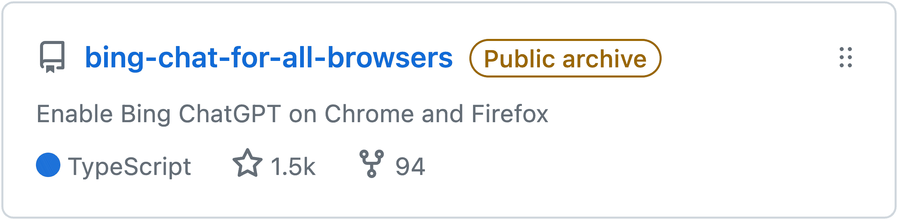
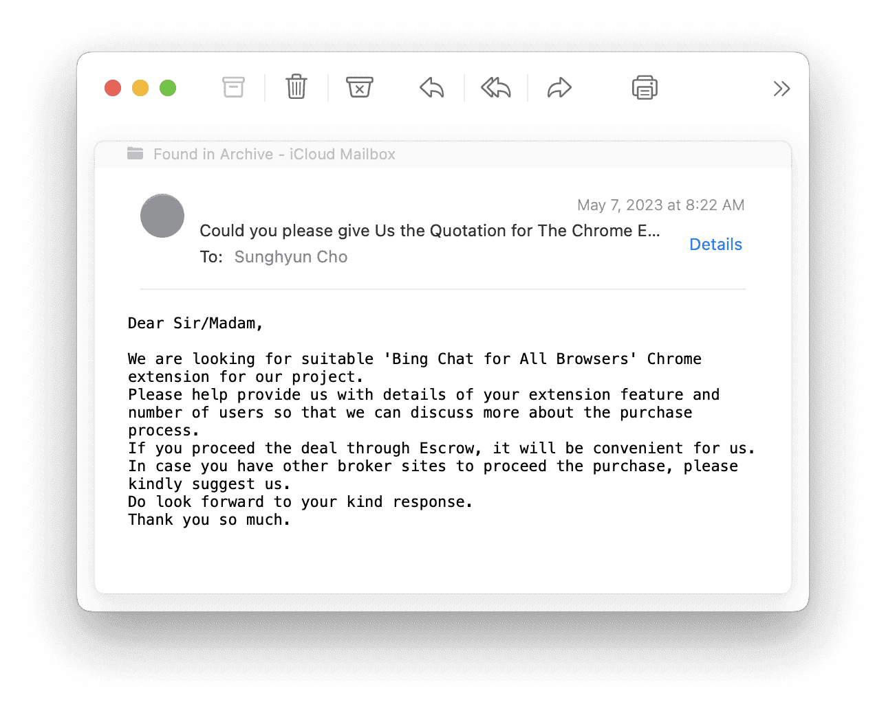
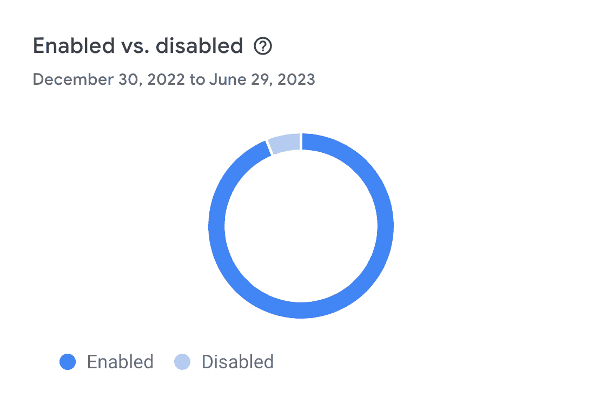

import Admonition from '@theme/Admonition'
import DisplayFlex from '@site/src/components/DisplayFlex'

# 마이크로소프트에게 내용증명 받고 23만 유저 앱 삭제한 건에 대하여 🗑️

ChatGPT를 활용한 검색 AI, Bing Chat은 Edge 브라우저에서만 작동한다. 그리하여 Chrome과 Firefox에서도 동작하도록 [확장 프로그램](https://github.com/anaclumos/bing-chat-for-all-browsers)을 제작했다. 길고 긴 우여곡절 끝에 75만의 방문자, 50만의 설치, 23만 명의 활성 사용자 수를 달성했고, 마이크로소프트에서 내용증명을 받는 것을 끝으로 프로젝트를 종료했다.

이제 그 이야기를 해보자.

## 첫 시장 등장

ChatGPT가 처음 출시된 이후 수많은 앱들이 시장에 출시되었다. 성공적으로 정착한 앱들의 공통된 특징은 조악하게 출발하여 시장에 안착해 수십만 사용자들의 관심을 받으며 반강제 성장했다는 점이다. 즉 무엇보다 중요한 것은 타이밍이었고 수많은 사람들이 사용하는 앱은 자연스럽게 발전한다는 사실을 확인했다. 그런 시장의 패턴을 관찰하며 기회를 살피고 있었다. 그러다 Bing Chat이 출시되었다. 대부분의 소비자는 어차피 Chrome을 사용하고, Edge도 어차피 크로미움 브라우저이다. 즉 Edge와 Chrome을 구별하기 쉽지 않을 테고, 그렇다면 자연스럽게 이를 우회하는 프로그램이 있다면 사람들이 사용할 것. 이를 생각하며 하루 만에 개발을 끝내서 배포했다. 굉장히 초반에 Bing Chat의 존재를 파악하고 웨이트 리스트를 신청해둔 것도 큰 도움이 되었다. 이에 대한 이야기는 나중에 해보도록 하자.

## 야후재팬 1면

첫 며칠은 유별난 사용자 증가가 없었다. Bing Chat이 초반에 GPU 부족을 이유로 웨이트 리스트 제도로 운용되며 많은 사람들이 Bing Chat을 쓰지 못했기 때문일 것이다. 그러다가 2023년 2월 말, 사용자가 급격하게 증가했다. 신기하게도 모두 일본 사용자들이었다.

<figure>

<figcaption>

야후재팬 IT면 1면에 걸리다. [아카이브](https://web.archive.org/web/20230219102830/https://news.yahoo.co.jp/articles/fa91cea4b421a3147e3345bb74f552fd3066e74f)

</figcaption>

</figure>

알고 보니 일본 1위 포털 야후재팬 1면에 소개되며 사람들이 대거 유입된 것이다. 그 이후로 유기적으로 사용자가 급증하기 시작했다. [Bing Chat과 일본에 대한 연구 노트](/r/6AA0FE)

## 23만 사용자 그리고 인수 제의

그렇게 지속적으로 사용자가 증가하면서 많은 사람들을 만났다. GitHub에서 1.5k 🌟도 달성해 봤다. 작성된 이슈는 약 120건 정도이며 이메일, Chrome 스토어, Firefox 스토어에서 대응한 건들을 합하면 대략 1,000건 정도로 추산한다. 하루 평균 10건 정도인데 후반에 훨씬 몰려 있었으니 후반에는 굉장히 바빴다.

그러던 중 여러 매체를 통해서 인수 의사가 있다는 사람들이 접촉해왔다. 주로 급격한 성장을 원하던 인공지능 관련 회사들이거나 기술 기업들의 광고를 수주하고 중개하는 회사들이었다. 특히나 이런 단순한 기능을 적용시켜서 한 번 자리를 잡은 앱들은 꽤나 괜찮은 인수 대상이다. 설치한 사람들의 관심 분야 명확하고 (Gen AI), 기능이 별로 없어 기술 부채 얕고 (자사 기능으로 넘겨가기 쉽고), 사용자층 넓고 이미 수많은 미디어와 블로그가 익스텐션 설치 페이지로 링크를 걸어 놓았으니 말이다.

<figure>

<DisplayFlex>

<figure>

</figure>

<figure>

</figure>

<figure>

</figure>

</DisplayFlex>

<figcaption>

여러 인수/광고 제의. 가격도 제각각이었다.

</figcaption>

</figure>

여러 이유로, 판매하거나 금전적으로 연루되지 않았다. 다만 협상 경험은 나중에도 도움이 될 듯하다. 하나 흥미로웠던 사실은, 그들은 사실상 제품보다는 23만+ 활성 사용자를 구매하고 싶은 것이었을 텐데도 서로 생각하는 단위 수가 극명하게 달랐다는 점이다.

## 창과 방패

그러던 와중에 마이크로소프트는 매주 브라우저 탐지 로직을 업데이트했다. 수십 건의 GitHub 이슈가 등록되고 있었고, 매일 많은 버그 리포트 이메일을 받고 있었다. 대부분은 사무적으로 몇 가지 순서에 따라서 새로고침을 하거나, 브라우저 User Agent 값을 고쳐주면 되었기에, 그렇게 어려운 수정은 아니었다.

그러다가 한순간에 내 인식을 바꿔놓는 사건을 겪는다. 밤 11시에 수십 명의 유저가 동시에 연락을 한 것이다. [GitHub 이슈](https://github.com/anaclumos/bing-chat-for-all-browsers/issues/74) 링크를 첨부해두겠다. 제일 큰 문제는 나는 문제없이 서비스를 이용할 수 있었고 도저히 내 기기와 주변인들의 기기에서 현상 재현이 안 되는 것이다. 그럼에도 2시간에 걸쳐 GitHub 그리고 받은 이메일은 계속 포화되고 있었다.

그렇게 밤새 잠도 제대로 자지 못하고 12시간 동안 디버깅을 한 결과 **마이크로소프트에서 독자적인 헤더 규격을 만든 것**을 알게 되었다. 애초에 Bing 혹은 Google 같은 고도의 프런트엔드 웹사이트는 사용되는 헤더와 쿠키, 그리고 로컬 스토리지가 수백 개에 달한다. 그중에서 어느 헤더의 유무가 서비스 접근에 영향을 주는지 가려내는 것은 쉬운 일이 아니다.

좀 극적으로 비유하자면 이와 같은 리버싱이나 CTF 해킹은 **미제 사건 수사**와 다를 게 없다. 어느 정보가 유효한 단서이고 어느 것이 불필요한 조건인지, 우연인지, 사람마다 다른 건지, 오탐지인지, 미 탐지인지 알 길이 없다.

<figure>

<DisplayFlex>

<figure>

</figure>

<figure>

</figure>

</DisplayFlex>

<figcaption>

`UserAgentReductionOptOut`이라는 헤더. 사용되는 사이트가 전세계에서 bing.com 뿐이다.

</figcaption>

</figure>

이때 마이크로소프트의 의지에 깊은 인상을 받았다. 생각해 보면 Bing에서 GPT-4 수준의 서비스를 무료로 제공하는 것도, 오직 Edge에서 사용 가능하도록 제한 걸어놓은 것들도 결국 AI를 이용해 구글과의 단판 승부를 원한 것일 거다. 그런 와중에 가장 큰 경쟁자 Chrome에서 자신들의 기능들을 모두 사용할 수 있도록 열어버리니, 그리고 23만 이상의 사용자를 Edge로 못 넘어오게 막고 있으니 마이크로소프트 입장에서는 꽤나 **고까웠을 것**이다. 이때를 기점으로 나는 이 프로젝트가 무한정 지속될 수 없다는 사실을 체감했다. 마이크로소프트는 지속적으로 자사의 제품을 위한 다양한 전술을 내놓을 것이고 무보수로 일하며 특히나 이런 밤샘 온콜(On-call)에 무한정 응하기 어렵다. 언젠가는 멈출 것이다. 그리고 나는 그 시점을 **대략 마이크로소프트가 타사 브라우저에 접근 권한을 열 때...**라고 짐작하고 있었다. 그때가 되면 제품의 시장 유효성이 사라지기 때문이다.

## Bing을 Bing이라 부르지 못하고

그러나 그 시점은 그렇게 멀지 않았는데, 이번에는 마이크로소프트가 상표권을 걸고넘어졌다. Bing의 로고와 이름을 사용하는 것은 문제가 되는 사항이므로 5일 이내 해결하지 못할 경우 Google 법률 팀에 요청해서 서비스를 정지하겠다는 것이다. 마이크로소프트가 직접 칼을 빼들었다는 **명예 훈장**을 받았다는 기분 반. 막막한 기분 반. 두 가지 감정이 교차하며 고민하기 시작했다. 소식에 따르면 마이크로소프트에서 늦어도 3월부터 내 익스텐션의 존재를 알고 있었으니 지금까지 방치하다가 이제서야 칼을 빼들은 것 같다.

<figure>

<figcaption>

tracer.ai는 마이크로소프트가 고용한 브랜드권 보호 소프트웨어 업체처럼 보인다.

</figcaption>

</figure>

인디 앱이 브랜드의 이름을 쓰는 것은 하루 이틀 일이 아니다. 특히나 익스텐션은 더 그렇다. 익스텐션은 본질적으로 서비스를 보조해 주는 프로그램이기 때문에 사용자들이 익스텐션을 설치하는 행위 자체가 자신들의 서비스를 지속적으로 이용할 것이라는 확증이다. 때문에 사용자들이 자신의 서비스를 위한 익스텐션을 개발하는 것을 장려했으면 했지 최소한 막지는 않는다. 내 익스텐션이 **Bing Chat의 접근성을 개선해 사용자를 늘렸으면 늘렸지** 과연 그 사람들이 아니라고 해서 브라우저를 완전히 Edge로 변경했을까? 나는 브라우저의 경로의존성이 더 크다고 생각하기 때문에, 내가 빼앗은 고객보다 (Edge로 바꿨을 수 있었는데 내 익스텐션 때문에 안 바꾼 사람들) 내가 데려온 고객(Bing Chat을 호기심에 Chrome에서 몇 번 사용해 볼 사람들)이 더 많았던 것 같은데 말이다.

<Admonition type="warning" title="그냥 겁주는거 아닐까요?" icon="💭">

물론 기계적으로 그냥 보내는 문서일수도 있다. 하지만 우선 우후죽순 등장하고 있는 Bing AI 관련 앱에 모두 문서를 보냈을 리 만무하다. 어쨌건 마이크로소프트 내부적으로, 사용자가 많은 앱들을 대상으로 조치를 취하기로 결정한 것이다.

무엇보다 과거에 **선례가 있는데**...

</Admonition>

### 선례: MikeRoweSoft 대 Microsoft

마이크로소프트는 상표권과 권리의 면에서 깐깐한 것으로 유명하다. 대표적으로 [2004년 학생 **마이크 로**(Mike Rowe)의 도메인 MikeRoweSoft.com에 등록상표 침해 소송을 건 사건](https://ko.wikipedia.org/wiki/%EB%A7%88%EC%9D%B4%ED%81%AC%EB%A1%9C%EC%86%8C%ED%94%84%ED%8A%B8_%EB%8C%80_%EB%A7%88%EC%9D%B4%ED%81%AC%EB%A1%9C%EC%86%8C%ED%94%84%ED%8A%B8)이 있다. 마이크도 나와 비슷하게 등록상표 침해 내용증명을 받았다. 그는 불응했으며, 법정 공방을 하다 소액에 합의했다. 지금 나의 상황도 그리 크게 다르진 않을 것이다.

### 결론

나도 서류를 받고 많은 생각이 들었다. 난생 처음 겪는 23만명이라는 숫자의 앱을 포기한다는 것이 쉬운 일이 아니다. 그럼에도, 앞서도 언급했지만 이미 정신적으로 포화된 상태였다. 수많은 사람들이 GitHub에서 기능 및 개선 요청을 하기 시작했고, 이메일로 끝도 없이 밀려드는 버그 리포트에, 제일 큰 문제는 디버깅을 할 수 없다는 것이다. **아마 이번 기회를 넘겼어도 마이크로소프트는 기술적 전술이든 법적 전술이든 무엇이든 지속적으로 무언가를 했을 것이다**.

더군다나 마이크로소프트에서 [머지않은 미래에 모든 브라우저에 개방할 것](https://twitter.com/MParakhin/status/1661775489542004743)이라는 입장을 발표했다. 기능을 다양하게 추가해서 앱 개발을 지속할 수도 있겠지만 그것은 사용자 수를 포기하기 싫어서 진행하는 개발이지 정말 제품을 위하여 하는 것은 아닐 것이다. 여러모로 제품 수명이 그리 길게 남지도 않은 셈이고, 구태여 불응하여 문제를 야기할 필요가 없었다.

그리하여 많은 교훈을 얻은 것에 만족하며 **여기까지 하기로 결정했다**. 이후 앱을 스토어에서 삭제(Unpublish)한 후 저장소를 아카이브했다.

## 배운 점

### 무보수 오픈소스는 감정노동자이다

가장 크게 느낀 점이다.

> 어떤 면에선 GitHub 알림은 부정적인 메시지의 연속입니다. 여러분의 앱이 만족스러울 때 PR을 여는 사람은 없습니다. 부족한 부분을 발견했을 때만 그렇게 합니다. 이러한 알림을 읽다 보면 약간의 시간만 투자해도 정신적, 감정적으로 지칩니다. [오픈소스 관리자가 되는 기분](https://nolanlawson.com/2017/03/05/what-it-feels-like-to-be-an-open-source-maintainer/)

나도 다르지 않았다. 이메일은 익명으로 불평하는 사람들이 넘쳐나며 순수하게 욕설과 불평만 하는 경우도 허다하다. 모든 사용자를 만족시키는 것은 불가능에 가깝다. 하나의 수정을 가하려 하면 반대하는 사람 셋이 항의하고 수정하지 않으면 그 기능을 원하던 사람들이 다시 항의한다. 매일 GitHub 알림은 꺼질 줄 모른다. 이런 작은 앱이 이 정도인데 도대체 중-대규모 작업은 어떻게 유지되는 것일까. 무보수 오픈소스에 있어서는 명예, 혹은 셀프-열정페이도 잠깐이지, 오래 지속하지 못한다.

### 리누스, 제노비스, 그리고 마태 효과

오픈 소스를 열렬히 지지할 때 등장하는 단골처럼 등장하는 문구가 있다.

> **보는 눈이 많을수록 오류들은 사소해진다**는 개발 철학을 [리누스의 법칙](https://ko.wikipedia.org/wiki/%EB%A6%AC%EB%88%84%EC%8A%A4%EC%9D%98_%EB%B2%95%EC%B9%99)이라고 한다.

하지만 우리는 그와 정확하게 반대되는 사회적 현상을 안다.

> **주위에 사람들이 많을수록 어려움에 처한 사람을 돕지 않게 되는** 현상을 [제노비스 신드롬](https://ko.wikipedia.org/wiki/%EB%B0%A9%EA%B4%80%EC%9E%90_%ED%9A%A8%EA%B3%BC)이라고 한다

그렇다면 도대체 무엇이 옳은 것일까? 내가 내린 결론은 후자에 더 가깝다. 과학계에서는 이미 존재하는 단어로, **마태 효과**라고 칭한다.

> 로버트 머튼은 저명한 연구자가 더 많은 혜택(지원금 등)을 가져가고, 잘 알려지지 않은 연구자는 그렇지 못함으로써 점점 두 사이에 격차가 벌어지는 현상을 두고 [마태 효과](https://ko.wikipedia.org/wiki/%EB%A7%88%ED%83%9C_%ED%9A%A8%EA%B3%BC)라 칭했다.

기여하는 사람들은 아주 소수이며 그들이 반복해서 기여한다. 아주 일부의 기여자가 반복해서 기여하며 그마저도 몇 가지 저장소에 극심하게 편중된다. 요컨대 기여자도, 기여 받는 저장소도 편중이 심하다.

### 가장 희귀한 자원은 인간의 의지

나는 지속적으로 프로젝트를 운영하고 발전시키는 것이 약한 듯하다. 이전에 진행한 프로젝트들도 치명적인 오류가 아니면 개선하고 발전시키는 것이 무척 힘들었다. 취미로 하는 작업들인 만큼 무엇보다 결정적인 요소는 의지력이었다. 즉 속도가 중요한 이유는 **시장까지의 시간(Time-To-Market)이 아니라 개인에 있어 가장 결핍되기 쉬운 의지력이 고갈되기 전에 유의미한 지표를 마련해야 하기 때문**이다. 그것이 되지 않는다면 장기적으로 유지할 의지력을 구매해야 한다 (=월급).

하지만 매번 단숨에 무슨 일을 하려고 하면 딱 단숨에 할 수 있는 만큼만 성과를 낸다. 단숨에 체력을 늘리는 방법도 있지만, 보다 근원적 해결책은 호흡의 균형을 맞추는 것이다. 이제는 **무산소 운동보다는 유산소 운동**이 필요한 때이다. 그래서 이제는 장기간 동안 지속적으로 발전시킬 수 있는 영속적인 장치와 서비스들을 개발해 보고 싶었다. 선의와 열정에만 의지하지 않고 자생력을 갖추고 지속적으로 새로운 가치를 창출하는 그런 서비스. 그런 서비스를 만들고 싶다는 생각이 들었다.

## 통계

마지막으로 몇 가지 통계를 남긴다.

 
🪦 기념비

<figure>

<figcaption>

시간에 따른 주간 사용자 수. Chrome 사용자가 21만, Firefox 사용자가 2만 명 정도 되었다.

</figcaption>

</figure>

<DisplayFlex>

<figure>

</figure>

<figure>

</figure>

<figure>

</figure>

</DisplayFlex>

<figure>

</figure>

<figure>

</figure>

<figure>

</figure>

<DisplayFlex>

<figure>

</figure>

<figure>

</figure>

</DisplayFlex>

<Admonition type="tip" title="마음에 드시나요?" icon="✅">

커피챗은 언제나 환영입니다. [이메일](https://mailhide.io/e/IXndXpED) 보내주세요!

</Admonition>
