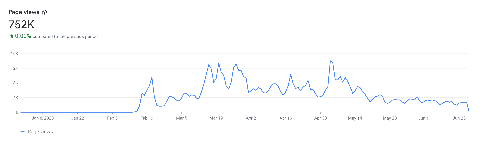

import Admonition from '@theme/Admonition';
import DisplayFlex from '@site/src/components/DisplayFlex'

# 마이크로소프트에게 내용증명 받고 23만 유저 앱 삭제한 건에 대하여 🗑️

<figure>

</figure>

ChatGPT를 활용한 검색 AI, Bing Chat은 [Edge](https://microsoftedgeinsider.com)에서만 작동한다.
그리하여 [Chrome](https://chrome.google.com)과 [Firefox](https://firefox.com)에서도 동작하도록 [확장 프로그램](https://github.com/anaclumos/bing-chat-for-all-browsers)을 제작해서 배포했다.
길고긴 창과 방패의 싸움 끝에 75만의 방문자, 50만의 설치, 23만명의 활성 사용자 수를 달성했고, 마이크로소프트에서 내용 증명을 받는 것을 끝으로 프로젝트를 종료했다.
이제부터 그 이야기를 해보겠다.

## 첫 개발 💻

ChatGPT가 처음 출시된 이후 수많은 앱들이 시장에 출시되었다.
성공적으로 정착한 앱들의 공통된 특징으로, 처음에는 조악하게 출발했지만 궁극적으로 시장에 안착하여 수십만명의 사용자들에게 관심을 받으며 강제 성장했다는 점이다.
즉 무엇보다 중요한 것은 타이밍이었고, 결국 수많은 사람들이 사용하는 앱은 자연스럽게 발전할 수 밖에 없다는 사실이다.

Bing Chat이 출시되었을 때 비슷한 생각을 했다.
대부분의 소비자는 어차피 크롬을 사용하고, 엣지도 어차피 크로미움 브라우저이다.
즉 마이크로소프트는 엣지와 크롬을 구별하기 쉽지 않을테고, 그렇다면 자연스럽게 이를 우회하는 프로그램이 있다면 사람들이 사용할 것.

이를 생각하며 **하루만에 개발을 끝내서 배포해보았다**.
굉장히 초반에 Bing Chat의 존재를 파악하고 웨이트리스트를 신청해둔 것도 큰 도움이 되었다.

## 야후 재팬 1면 🎖️

<figure>

<figcaption>

야후 재팬 IT면 1면에 걸리다. [원본](https://web.archive.org/web/20230219102830/https://news.yahoo.co.jp/articles/fa91cea4b421a3147e3345bb74f552fd3066e74f)

</figcaption>

</figure>

첫 며칠은 그렇게 급격한 사용자 증가가 없었다.
아무래도 Bing Chat이 초반에 GPU 부족을 이유로 웨이트리스트 제도로 운영되며 많은 사람들이 Bing Chat을 쓰지 못했기 때문일 것이다.
그러다가 2023년 2월 말, 사용자가 급격하게 증가했다.
그런데 신기하게도 모두 일본 사용자들이었다.
알고보니 일본 1위 포털, 야후재팬 톱뉴스 IT 섹션에 소개되며 거기로부터 사람들이 대거 유입된 것이다.
그 이후로 유기적으로 사용자가 급증하기 시작했다.
[Bing Chat과 일본에 대한 연구 노트](/r/6AA0FE)

## 20만 주간 사용자

그렇게 지속적으로 사용자가 증가하면서 많은 사람들을 만났다.
GitHub에서 1k ★도 달성해봤다.

## 인수 제의와 거절

그러던 와중 여러 매체를 통해서 인수 의사가 있다는 사람들이 접촉해왔다.
주로 급격한 성장을 원하던 인공지능 관련 회사들이거나
기술 기업들의 광고를 수주하고 중개하는 회사들이었다.

특히나 이런 단순한 기능을 적용시켜서 한 번 자리를 잡은

<figure>

<DisplayFlex>

<figure>

</figure>

<figure>

</figure>

</DisplayFlex>

<figcaption>

여러 인수 제의. 가격도 제각각이었다.
하지만 여러 이유로 판매하지 않았다.

</figcaption>

</figure>

## 마이크로소프트 창과 방패의 대결

## 상표권 침해 내용 증명

## MikeRoweSoft, 그리고 앞으로

마이크로소프트는 상표권과 권리의 면에서 깐깐한 것으로 유명하다.
대표적인 예시로

서류를 받고 많은 생각이 들었다.
20만명이 사용하고 있는 앱을 포기한다는 것이 쉬운 일이 아니었다.
그럼에도 불구하고 많은 교훈을 얻은 것에 만족하며 여기까지 하기로 결정했다.
수많은 사람들이 GitHub에서 기능 및 개선 요청을 하기 시작했고,
이메일로 끝도 없이 밀려드는 버그 리포트에 정신적으로 포화된 상태였다.
게다가 제일 큰 문제는 디버깅을 할 수 없다는 것이다.

아마 이번 기회를 넘겼어도 마이크로소프트는

그럼에도 그렇게 수많은 사람들과 소통하며 그들을 최선을 다해서 도왔다는 점에서 많은 것을 배웠다.

앞으로는 무엇을 해야할까?
나는 아무래도 지속적으로 프로젝트를 운영하고 발전시키는 것이 약한 듯 하다.
이전에 진행한 프로젝트들도 치명적인 오류가 아니면 개선하고 발전시키는 것이 무척 힘들었다.
아무래도 취미로 하는 작업들인 만큼 무엇보다 결정적인 요소는 의지력이었다.
즉 속도가 중요한 이유는, 시장까지의 시간이 아니라,
개인에 있어 가장 결핍되기 쉬운 의지력이 고갈되기 전에 유의미한 지표를 마련해야하기 때문이다.

하지만 매번 단숨에 무슨 일을 하려고 하면 딱 단숨에 할 수 있는 만큼만 성과를 낸다.
단숨의 체력을 늘리는 방법도 있지만, 보다 근원적 해결책은 호흡의 균형을 맞추는 것이다.
이제는 무산소 운동보다는 유산소 운동이 필요한 때이다.

그래서 이제는 장기간 동안 지속적으로 발전 시킬 수 있는 영속적인 장치와 서비스들을 개발해보고 싶었다.
지속적으로 새로운 가치를 창출하는 그런 서비스.
그런 서비스를 만들고 싶다는 생각이 들었다.

# OSS Matters. OSS is hard. OSS is a mental service. Free, unfunded OSS is much harder.

# Law matters. Move fast and break things, except legal stuffs

# Communication matters.

# It's not possible to satisfy all users when dealing with 100K+ users

📊 Stats

<DisplayFlex>

<figure>

</figure>

<figure>

</figure>

<figure>

</figure>

</DisplayFlex>

<figure>

</figure>

<figure>

</figure>

<figure>

</figure>

<DisplayFlex>

<figure>

</figure>

<figure>

</figure>

</DisplayFlex>

