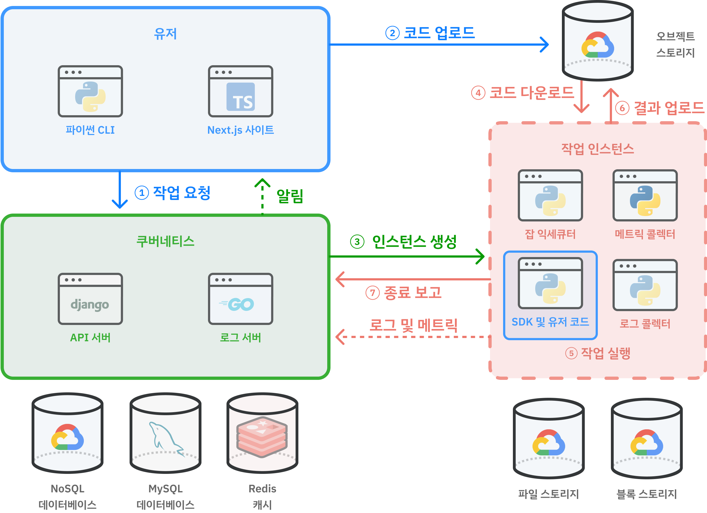

<!-- truncate -->

최근 가장 많은 노력을 쏟은 것은 루닛에서의 MLOps 업무이다. 첫 직장인 이곳에서 MLOps 플랫폼의 프론트엔드 전체를 현대적으로 재개발을 리드했는데, 결과적으로 성공 반, 실패 반으로 끝났다. 그 이야기를 조심스레 해보려 한다.

## MLOps란

의료 AI 기업 루닛에서는 매일 수백 개의 ML 실험들이 일어난다. 초기에는 높은 용량의 계산 성능을 경제적으로 감당하기 위해 온 프레미스 서버를 사용했지만, 수많은 수동 작업 때문에 빈번한 공수가 들었다.

1. 온 프레미스 서버는 확장이 어렵다. 팀원 수가 늘면 자원 수요가 증가하고, 마감이 다가오면 학습 수요가 급증한다. 새 하드웨어 구매에는 비용, 시간이 많이 들며, 필요한 용량 예측도 어려워 과소, 과대 투자 위험이 있다.
2. 서버 노후화로 GPU 장애가 빈번하다. 구식 GPU는 성능 저하나 고장으로 이어져 다운타임과 유지비를 높인다.

이 때문에 클라우드로의 마이그레이션을 고민했으나, 가장 큰 문제는 클라우드를 사용함에 따라서 발생하는 별도의 번거로움이었다. 일반적으로 클라우드에서는 ① 가상 머신 생성 ② 학습 환경 설정 ③ 모델 학습 ④ 클라우드 스토리지 저장 ⑤ 가상 머신 삭제의 순서를 거치는데, 이 과정 내내 사람이 번거롭게 관리해 줘야 한다. 이뿐만이 아니라, ① 실험 결과 관리 ② 로그 모니터링 ③ 오류 처리 등에서 추가적인 공수가 훨씬 더 많이 필요하다.

이 번거로운 과정을 자동화하기 위해 2021년 경부터 루닛에서는 INCL이라는 MLOps 플랫폼를 구축했다. 시중에 존재하는 [Weight & Bias](https://wandb.ai/), [Vessl](https://vessl.ai/), [SkyPilot](https://github.com/skypilot-org/skypilot)과 유사하지만, 이를 의료 AI 도메인에 맞추어 구축했다고 이해하면 된다. 대표적으로 실험 코드와 추적할 지표 이름을 제공하기만 하면 자동으로 클라우드 환경에서 실험을 진행한 뒤 보기 좋은 그래프로 정리해주는 기능을 제공한다. 덕분에 실험의 속도가 압도적으로 빨라질 수 있었고, 출시된지 4년 정도 지난 지금까지 약 800만개의 실험이 일어났다. 이에 대해서 궁금하다면 [루닛의 공식 블로그 포스트](https://medium.com/lunit/intelligent-cloud-part-1-introduction-to-lunits-cloud-deep-learning-platform-for-efficient-94fd2da2a3f2) 또는 내 [요약본](/ko/r/FC0D3A)을 참고해보자.

<figure>

<figcaption>

서비스를 간략하게 그려보자면 위와 같다. VM을 만들어주고 대신 관리하는 중간 서버로 이해하면 편하다.

</figcaption>

</figure>

그러나, 회사 안에서만 쓰는 인터널 앱이라는 특성 상 어쩔 수 없이 기술 부채가 심해져갔다. 그저 _동작만_ 하면 되는 상태였기 때문이다. 때문에 최적화 또는 코드 정리는 항상 뒷전일 수 밖에 없었고, 결과적으로 굉장히 크고 무거운 웹 서비스가 되었다.

루닛에 합류한 작년 5월부터 나는 이것을 개선하자는 의견을 줄곧 피력해왔다. 첫째는 모든 동작이 수 초간의 로딩이 걸리는 것이 쌓이고 쌓여 연구자들의 시간을 달마다 수십 시간씩 뺏고 있다는 계산이고, 두 번째는 이 서비스를 개편하면 오픈 서비스로 만들 수 있겠다는 기대 때문이었다. 팀에서도 오픈 서비스로 나아가는 좋은 방향성이라는 것에 대해서 동의했다. 팀 입장에서는, 더 나아가 새로 추가하고 싶었던 기능들이 다양하게 있었는데 기존의 거대해진 코드베이스 때문에 변경이 매우 어려워졌다는 점, 그래서 사용자들이 요청하는 기능들이 항상 계류되고 있다는 점을 타파하기 위한 좋은 기회로 보았다. **동상이몽**이었지만, 어찌 되었든 INCL을 가장 매력적인 MLOps 서비스로 만들자는 점에는 동의하고 있었다.

## 네덜란드 이야기

다른 점에 앞서, INCL 시스템에는 직관적으로는 쉽사리 이해되지 않는 치명적인 엔지니어링 부채가 존재했으니, 모든 클라우드 리소스가 네덜란드에 존재한다는 점이다. 가장 큰 이유는 처음에 서버 위치를 선정할 당시 네덜란드 GCP 서버에 유휴 자원이 가장 많았기 때문이다. 백엔드 서버 또한 컨테이너에서 돌아가는 수많은 데이터를 기록하고 추적해야하고, 외부에 있다면 외부통신 비용이 별도로 발생하기에, 네덜란드에 있을 수 밖에 없었고, 결과적으로 모든 자원이 네덜란드에 발이 묶여버리게 되었다. 사실상 지구 반대편에 있으니, 물리적으로 시간이 오래 걸릴 수 밖에 없었다.

하지만 예로부터 독한 병엔 극약처방이 필요하다고 했었던가? 난세에는 영웅이 등장하는 법이다.

import { KoreaNetherlandsGlobe } from './korea-netherlands'

<KoreaNetherlandsGlobe lang="ko" />

거리가 잘 상상이 되지 않는다면 위 버튼을 눌러 거리를 직접 가늠해보자. 일부 페이지는 네트워크 요청이 4번 chain되는 경우도 있었는데, 그러면 총 8번 저 거리를 다녀와야 한다!

:::warning

작성 중

:::
