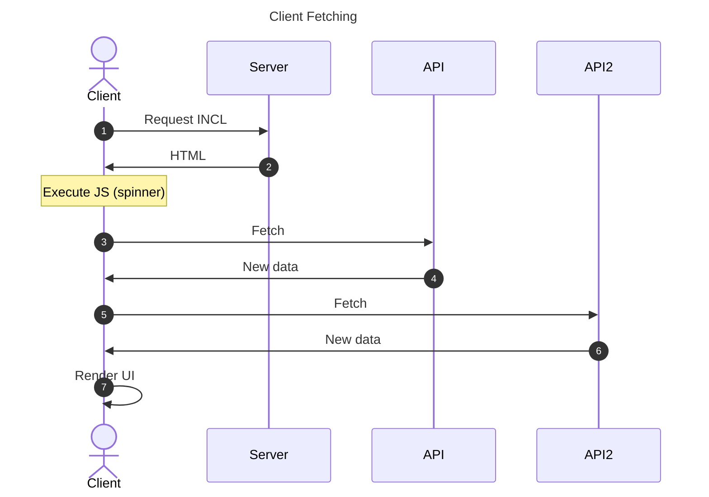
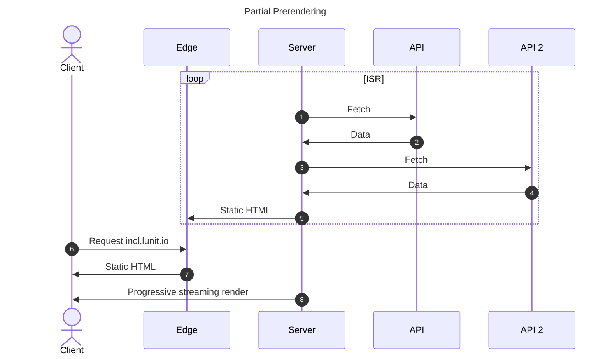
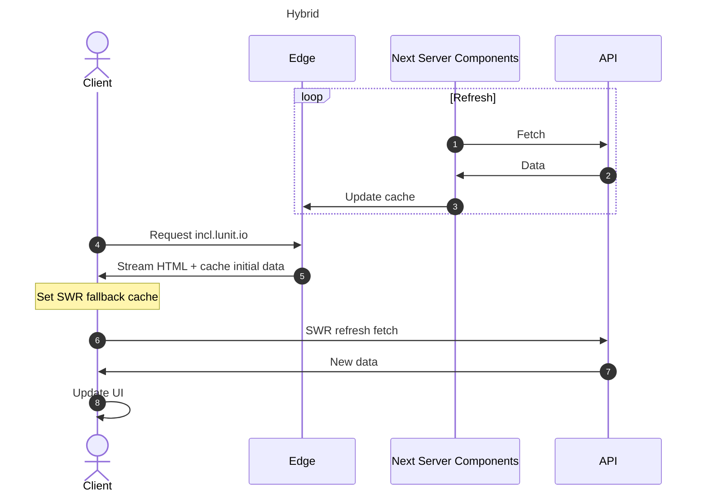

<!-- truncate -->

import Admonition from '@theme/Admonition'
import DisplayFlex from "@site/src/components/display-flex"
import { KoreaNetherlandsGlobe } from './korea-netherlands'

Recently, I've poured most of my effort into MLOps work at Lunit. At my first job here, I led the modern redevelopment of the entire front-end for our MLOps platform. In the end, it was half success, half failure. Let me share that story.

## AutoML

First, let me introduce our team, the AutoML team. The AutoML team operates the MLOps platform called INCL within Lunit.

At Lunit, a medical AI company, hundreds of ML experiments run every day. Initially, we used on-premise servers to affordably handle the high computational demands, but this required frequent manual intervention. On-premise servers are hard to scale. As the team grows, resource demand increases, and as deadlines approach, training demand spikes. Purchasing new hardware is costly and time-consuming, and it's difficult to predict the needed capacity, risking under- or over-investment. Additionally, aging servers lead to frequent GPU failures. Older GPUs suffer from performance degradation or breakdowns, increasing downtime and maintenance costs.

For these reasons, we considered migrating to the cloud, but the hassle of using the cloud was the biggest problem. Typically, cloud workflows involve creating a virtual machine, setting up the training environment, training the model, saving to cloud storage, and deleting the virtual machine, requiring scientists to manage this process tediously. Beyond this, there's even more overhead for experiment result management, log monitoring, error handling, and so on.

To automate this process, Lunit built an MLOps platform called INCL starting around 2021. It's similar to [Weights & Biases](https://wandb.ai/), [Vessl](https://vessl.ai/), and [SkyPilot](https://github.com/skypilot-org/skypilot), but customized for the medical AI domain. Like typical MLOps platforms, you just provide experiment code and metric names to track, and it automatically runs experiments in the cloud and presents them in clear graphs. This dramatically accelerated experimentation speed, and since its launch about four years ago, approximately 8 million experiments have been conducted. If you're curious, check out [Lunit's official blog post](https://medium.com/lunit/intelligent-cloud-part-1-introduction-to-lunits-cloud-deep-learning-platform-for-efficient-94fd2da2a3f2) or my [summary](/r/FC0D3A).

:::note

We manage infrastructure independently and work on our own schedule, so it feels very much like an internal startup serving Lunit as our customer.

:::

However, being an internal app, technical debt accumulated. As long as it just _works_, that's enough. Optimization or code cleanup was always deprioritized in favor of new features, and the result was a large, heavy web service.

Since joining Lunit in May 2024, I've advocated for improving this. First, every action taking several seconds of loading adds up to dozens of hours stolen from researchers each month. Second, I hoped that revamping this service could make it viable as an open service. The team agreed this was a good direction toward becoming an open service. From the team's perspective, there were various features they wanted to add, but the bloated codebase made changes extremely difficult. User-requested features were always in limbo. This was seen as a great opportunity to break through.

It was a **shared dream with different visions**, but everyone agreed on making INCL the most attractive MLOps service.

## Netherlands and Data Fetching Paradigms

INCL had a critical engineering debt that isn't intuitively obvious: all cloud resources exist in **the Netherlands**. The reason is that when initially selecting server locations, the Netherlands GCP server had the most idle resources. The backend server also needs to record and track vast amounts of data running in containers, and being external would incur egress costs, so it had to be in the Netherlands too. As a result, all backend resources were stuck in the Netherlands. It was physically bound to take a long time. If you can't imagine the distance, **click the button below to gauge it yourself**. Some pages had 4 chained network requests, meaning 8 round trips across that distance!

<KoreaNetherlandsGlobe lang="en" />

But as they say, desperate times call for desperate measures. Heroes emerge in troubled times. Since we started from `pnpm init`, we had the opportunity to change everything to address this technical debt. It was the perfect chance to overhaul from the start using new Next.js and React technologies like App Router and React Server Components, a potential technical breakthrough that could solve our Netherlands issue in one stroke. During initial exploration, I researched various ways to use Server Components, SWR, Streaming SSR, and Partial Prerendering.

Client Fetching

- 👍 Can view experiment data in real-time
- 👍 Can regularly fetch latest data using SWR or React Query
- 👎 Client fetching alone is too slow
- 👎 Some speed improvement possible by optimizing chained network calls, but not significant

Partial Prerendering (Latest React Server Components Paradigm)

- 👍 Very fast loading via bundle size optimization
- 👎 Doesn't improve data fetching itself (doesn't help much with Netherlands round-trip problem)
- 👎 With Stale-While-Revalidate pattern, old data shows first and updates in background
- 👎 Requires prior visit to see latest info, unsuitable for apps with lots of personalized data

## Hybrid

Ultimately, I chose a workaround approach: injecting seed data from the server into SWR's fallback data and intentionally turning off SWR's initial `isLoading` value. By leveraging Next.js's cache layer to inject data from Next.js Server Components and immediately passing Server Component data as SWR fallback via Streaming SSR, we could **achieve both the fast initial load of Server Components and SWR's live data, at the cost of bundle size**.

- 👍 Improves data fetching itself (initially displayed data is cached)
- 👍 Updates to latest info after a few seconds via client-side SWR
- 👍 Screen auto-updates without refresh via client-side SWR
- 👍 Suitable for apps with lots of personalized data
- 👎 Relatively larger bundle size

<video width="640" height="360" loop muted autoPlay playsInline controls className="w-full h-auto">
      <source src={require('./F70351.mp4').default} type="video/mp4" />
      Your browser does not support the video tag.
</video>

The screen auto-updates with the latest data without refreshing. This was the feature that most improved quality of life for researchers constantly monitoring experiment results!

The reason I controlled by intentionally turning off `isLoading` was that I wanted to unify loading state control through SWR's `isLoading`, but SWR's `isLoading` is always true on initial load even with fallback data, so the loading screen would show even with seed data from the server. Now there are more advanced patterns, most notably passing a prefetch Promise started on the server down to the client and consuming it with the `use` hook. However, if server-side data fetching takes long, you still need to consider caching in various ways.

In conclusion, I think PPR and Server Components are unsuitable for interaction-heavy apps. Our reason for using Server Components was less about the benefits Vercel promotes and more about using Next.js Server Cache Directive. If the DB and API server moved closer, SWR alone would probably suffice. It was also disappointing that experiment data can be tens of MBs, and Next.js Cache's maximum size is 2MB, requiring additional workarounds.

## Toward a Modern Web

### Next App Router

I fully adopted Next App Router this time. While other things just changed approaches from Pages Router without overwhelming convenience, Nested Layout was overwhelmingly convenient (though there was an issue where `layout` and `children` were hard to draw if not rectangular). By actively utilizing this pattern, I could also compose layouts like the following...

### Miller Columns

[Miller columns](https://en.wikipedia.org/wiki/Miller_columns) refer to multiple columns stretching horizontally in directories with mixed hierarchies.

For example, this screen in Mac Finder is also a type of Miller column.

There are many users, projects, and jobs, and users need to navigate between many jobs across different projects. The existing structure simply tied these in a Tree structure with Pagination inside the Tree, making it very difficult to find Jobs.

Therefore, I wanted to create a structure like this:

This was mistaken for typical nested layouts, but then making the **list view** visible instead of main content on mobile would be difficult.

It looks simple at first glance, but it's really painful without App Router's Nested Layout. I got great help from a [message](https://x.com/flybayer/status/1818009089735279057) by Brandon Bayer of Blitz.js and FlightControl.dev: put content in `layout.tsx` and intentionally leave `page.tsx` empty.

<video width="640" height="360" loop muted autoPlay playsInline controls className="w-full h-auto">
      <source src={require('./5F8BA9.mp4').default} type="video/mp4" />
      Your browser does not support the video tag.
</video>

I'm proud of implementing complex hierarchical data in just a few hundred lines through deep UX consideration and technical understanding of Nested `layout.tsx`.

The final implementation is shown above. Multiple columns overlap, and the selected column folds with text appearing vertically like a book on a shelf. Of course, each column supports infinite scroll, context menus (three-dot menus), sorting, and filtering.

It's still early, so some haven't adapted to the new interface and we're receiving improvement feedback, but we've confirmed that users generally like the considerate interface developed across all aspects.

Here are some components I made. Try them out (keyboard shortcuts only work after clicking the `iframe` above to focus it).

### Mobile Support

**Studio apps** for work tend to focus only on desktop apps. Most work is done on desktop anyway. INCL was the same, but since AI training typically takes hours, there was steady demand to check on training progress on mobile while on the go. Previously, mobile wasn't considered at all, making users very uncomfortable. This time, using Tailwind's responsive UI, I improved it to look good on both desktop and mobile **while sharing most of the code**.

<DisplayFlex>

</DisplayFlex>

:::note

Considering visibility and readability on mobile, I designed it following what I believe Apple's Human Interface Guidelines aim for.

:::

## Toward an Open Ecosystem

While working, I actively adopted and improved major libraries like [TanStack/table](https://github.com/TanStack/table) and [shadcn-ui/ui](https://github.com/shadcn-ui/ui), as well as newer open-source libraries like [toss/es-toolkit](https://github.com/toss/es-toolkit) and [47ng/nuqs](https://github.com/47ng/nuqs), using them where appropriate. I also contributed to help shape their roadmaps. **Contributing to upstream code when stuck became routine**. Here are some examples:

- [toss/es-toolkit: (feature) Add Custom Delimiter Support to flattenObject Utility #933](https://github.com/toss/es-toolkit/pull/933)
- [47ng/nuqs: Server-side \`clearOnDefault\` and \`urlKeys\`](https://github.com/47ng/nuqs/issues/679)
- [juliencrn/usehooks-ts: useLocalStorage Hydration Mismatch -- Need to setIsClient everywhere](https://github.com/juliencrn/usehooks-ts/issues/644)
- [vercel/next.js: Using Async Tags with Revalidate on Next.js Server Fetch Contaminates JSON Response](https://github.com/vercel/next.js/issues/73874)
- [vercel/swr: \`revalidateOnMount\` With Fallback triggers \`isLoading\` instead of \`isValidating\`](https://github.com/vercel/swr/issues/3046)
- [vercel/swr: Visiting 404 Not Found clears all SWR Cache](https://github.com/vercel/swr/issues/3002)

Some disappointments with open source: TanStack Table doesn't seem designed for Row data that changes in real-time. For example, you need to write custom logic to handle table pages, selected rows, and which columns should display when Row values change.

For `shadcn/ui`, the dialog comes out as a `React Portal`, which made it cumbersome to calculate mouse `offset` on screen when implementing drag-and-drop. In the end, I implemented the drag-and-drop dialog as a dialog that looks identical to Shadcn dialog.

## State Management

With SWR, what I've consistently advocated is that you don't need separate state management. All information should be managed by the server anyway, and since state stays current when you directly update server data and it updates to the client in real-time via SWR, there's no need for state management.

Often when I say this, the discussion gets dismissed as lacking experience with complex apps, and when I ask why it doesn't work in complex apps, there's no convincing rationale. So I tried it myself and learned what they meant by lacking complex app experience. Thinking about it, **all front-end complexity problems stem from lack of API control**. SWR specializes in keeping state current from a single endpoint, but for graphs displaying combined data from multiple sources, I had to create a massive SWR hook orchestrating multiple SWR hooks like a game of Simon Says. I later significantly simplified this by creating custom fetch functions, but the conclusion was that SWR alone is insufficient for managing state when **combining** information from multiple APIs.

Managing state with SWR alone was an idealistic picture only possible with one unified API per feature. In that sense, it's regrettable that management points increased as combination SWR hooks proliferated. It was a problem of not thoroughly specifying API specifications, and I keenly felt that our team lacks an explicit technical PM.

Also, there's information that isn't stored on the server. For example, I thought graph values and table view settings users configure should be [stored in URLs from the start](https://x.com/leerob/status/1708280997488333078), and users should bookmark those URLs. But large data that's hard to fit in URLs started appearing, and I eventually had to write [code to sync local storage data with URL state](https://github.com/47ng/nuqs/discussions/606#discussioncomment-11850582). This seemed like the best approach for wanting URLs as the source of truth for local state. However, for data like table information, I had to exclusively use `useLocalStorage`.

<Admonition type="info" title="Though I still believe rather than adopting state management libraries" icon="📊">

The backend should compose a single API per view, or at minimum set up a BFF to combine and organize multiple BE APIs. However, due to various practical difficulties, if given another chance, I'd probably use Zustand with Local Storage Persistence for some information.
</Admonition>

## Looking Ahead

Having discussed the rebuild, let's explore why we did it and what dreams we're chasing.

### Cursor for ML

Lunit wants to build Cursor for ML. Rebuilding INCL's front-end was part of that effort. Now Lunit is integrating various Agentic AI to create a platform where users can input:

<Admonition type="info" title="User" icon="🧑‍💻">

In the last hyperparameter optimization experiment, let's expand the search space a bit and run it again. Use A100 instead of V100 this time. When it's done, if accuracy exceeds 98%, let me know on Slack.
</Admonition>

and the experiment proceeds **automatically and intelligently**. The vision is to accelerate medical AI development through this. In other words, Lunit wants to transform AutoML's meaning from Automated ML to Autonomous ML.

### The AWS of AI

I believe that along the way, intermediate byproduct products, like our MLOps products, can be externalized to grow into a platform company. These intermediate products could become cash cows for medical AI development.

For example, why did Amazon release AWS? At the time, Amazon hadn't solidified its position as the #1 internet store, and releasing AWS was a risky decision that could help offline competitors transition to cloud and threaten Amazon. Yet Amazon released AWS because it was a way to diversify their portfolio by growing AWS into a product line independent of Amazon, increasing financial stability while stabilizing the platform through external AWS customers. Now AWS's overwhelming profit margins effectively back Amazon's high-volume, low-margin strategy, serving as the catalyst for Amazon's growth into the undisputed #1 e-commerce company. None of this would have happened without releasing AWS externally.

I believe Lunit's ML product line could play a similar role. Though numerous products exist in the market, few companies are as committed to end-to-end cost optimization as Lunit. **In short, most MLOps platform companies focus on making it difficult for customers to easily optimize costs**. Therefore, they have business models that do minimal cost optimization and bill customers for the rest. Lunit, however, is both an ML training customer and an ML training platform provider. Knowing both sides' information enables optimizing all costs across the entire pipeline, and [INCL specializes in this](https://cho.sh/r/C669C9). Using INCL actively saves cloud idle resources, reducing costs by 60-91%. Isn't that appealing from a customer's perspective?

For these reasons, I believe Lunit's MLOps product line can be externalized to grow into a platform company.

## Our Team Is Hiring

- [Senior](https://wrkbl.ink/aw1ZHsB)
- [Junior](https://wrkbl.ink/6YGf3CJ)

In this context... our team is hiring someone to **work directly with me**. We're looking for someone to advance the best MLOps platform and integrate Agents to build Cursor for ML. This requires understanding across backend, front-end, infrastructure, and the AI ecosystem. As one example, to solve the problem of finding cloud idle resources for LLMs being difficult, I'm working on integrating tracking for model training experiments on personal GPU environments. It's work combining cloud training's convenience with the power of users' personal GPUs. Similar to GitHub Actions' Self-hosted Runner.

If you're an **engineer with broad platform understanding** and want to join the **dream of building Cursor for ML**, just apply to the job posting. I can say this because I also applied to Lunit on a whim, and that _knock and the door shall be opened_ mindset brought me here.

🏋️ Impact

- Efficiency gains and financial impact
  - Average daily time saved per user: ~8.45 minutes
  - Monthly total time saved (30 users): ~10.5 days
  - [With average AI professional salary of 100 million KRW](https://biz.heraldcorp.com/article/3355824#:~:text=AI%20%EB%93%B1%20%EA%B0%9C%EB%B0%9C%20%EC%A7%81%EA%B5%B0%EC%9D%98%20%EC%97%B0%EB%B4%89%EC%9D%80%201%EC%96%B5100%EB%A7%8C%EC%9B%90), **cost savings of over 200 million KRW annually**

- User satisfaction with new INCL
  - Previous INCL average satisfaction: 7.14 / 10
  - New INCL average satisfaction: 8.48 / 10
  - Productivity improvement: 84% of users felt increased productivity

