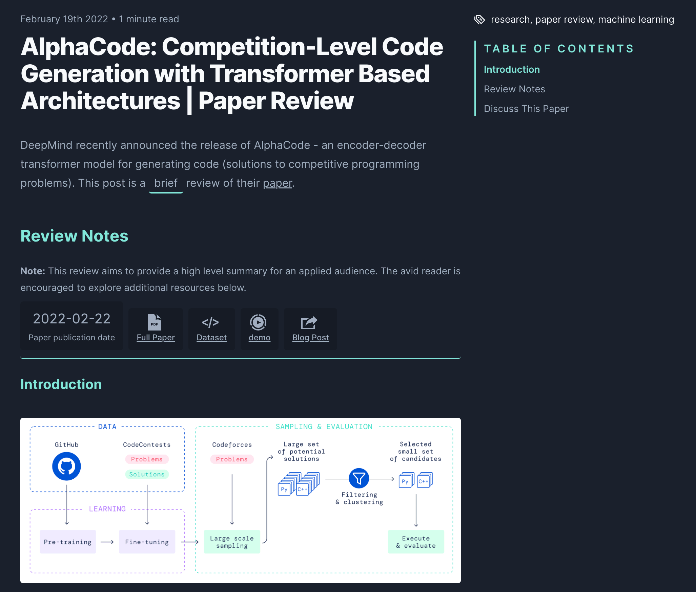
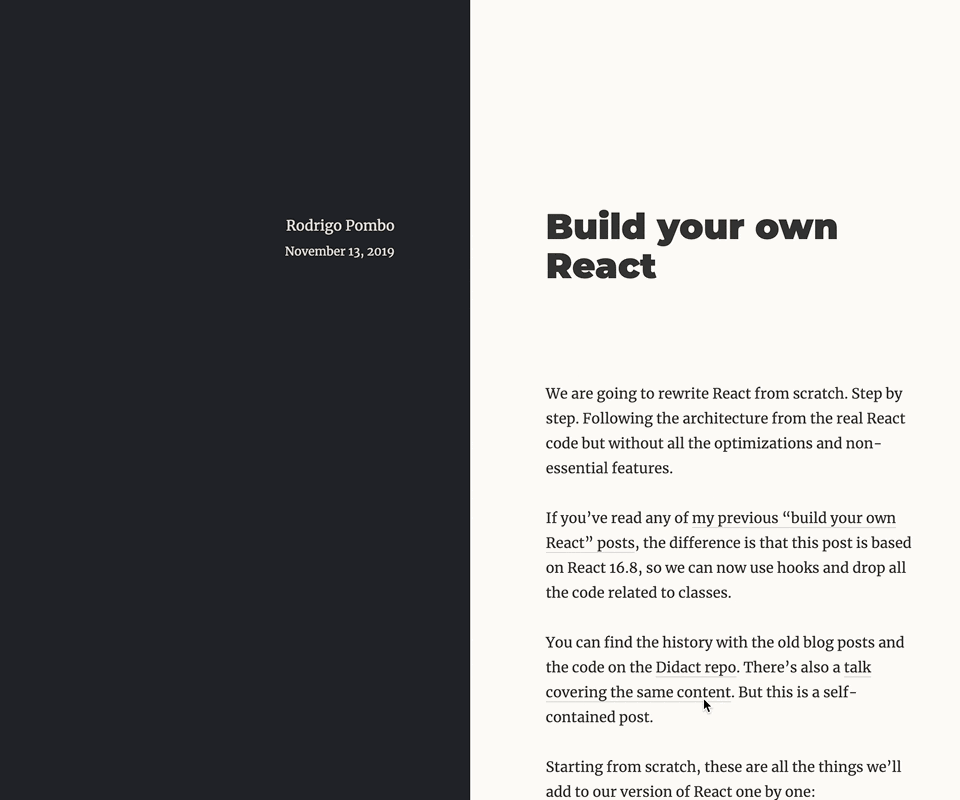
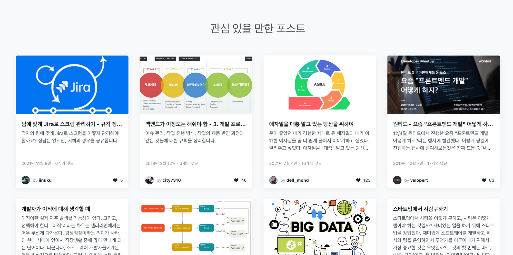
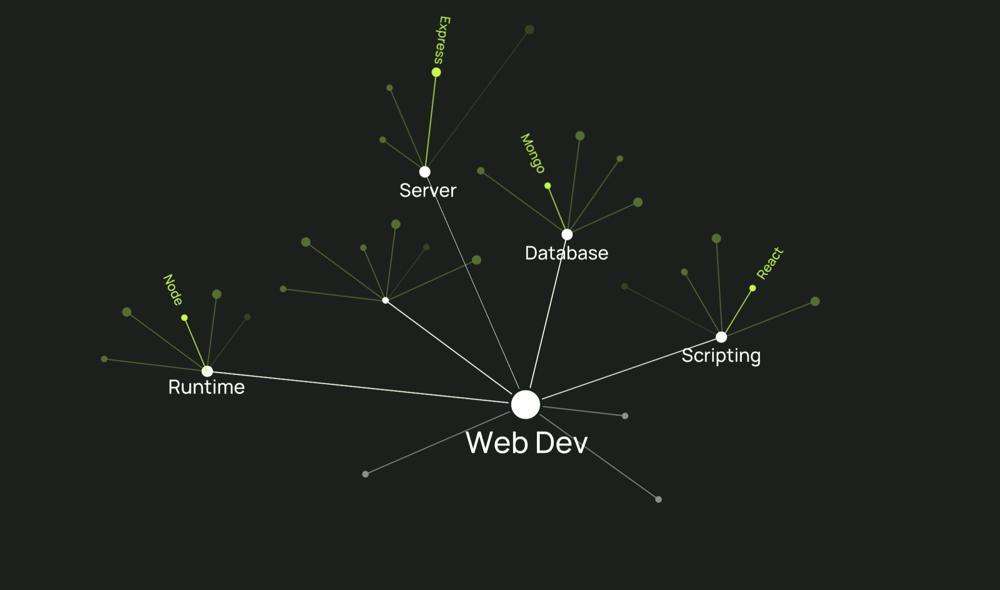
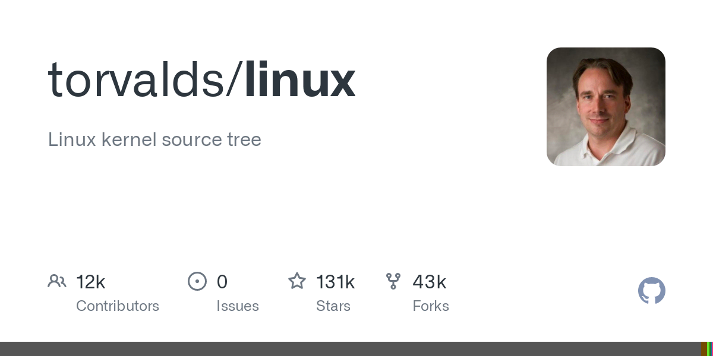
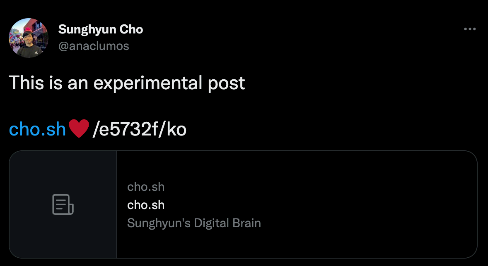
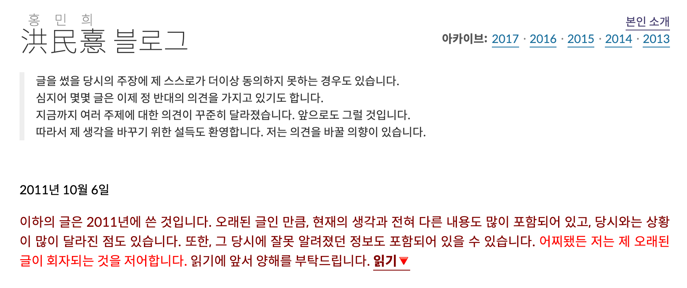
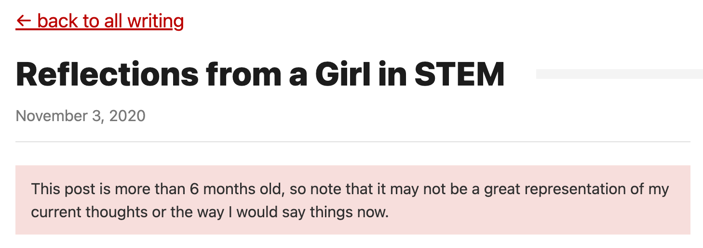

After a few years of technical writing, I felt limitations on writing platforms that hindered me from writing the best-class articles. Technological knowledge is dynamic and intertwined in that none of the current formats – academic papers, lecture videos, code examples, or straightforward posts – can best represent the knowledge. I have examined and observed some attempts that addressed this issue, namely, stuff called the **second brain** or **digital gardens**, but none of them seemed to correctly solve the problem. Therefore, I have distilled my inconveniences into this huge mega-post and imagined **_what I would've done if I had created the new incarnations of digital brains._**

:::info **Update 2022-06-12**
Since this post, I have extensively studied non-linear PKM software, such as [Roam](https://roamresearch.com/), [Obsidian](https://obsidian.md/), [Logseq](https://logseq.com/), and [Foam](https://foambubble.github.io/foam/). I acknowledge that I misunderstood the concept of manual linking; that PKM software performs a fuzzy search to intelligently identify linked and unlinked references. I found some PKM software with automatic linkings, such as [Saga](https://saga.so) or [Weavit](https://www.weavit.ai/). But none of them worked how I expected. Manual linking helps refine the database. So, even if I make a Next-gen digital brain, I will not remove the linking process.
:::

:::tip **Update 2022-07-01**
Well, you're now watching my next-gen digital brain! For the past two weeks, I have worked on the [WWW project](https://github.com/anaclumos/www) that built this website. It checks off almost all of the marks detailed in this post!
:::

TL;DR

- Create an **aesthetic**-**interactive**-**automatic** pile of **code**-**image**-**repo**-**text** that **organizes**-**presents**-**pitches** itself.
- There is **no** manual tagging, linking, or image processing, etc., etc.
- You just throw a random knowledge; creating a **knowledge mesh network**.
- The **algorithm** operates everything. It will be contained, processed, organized, and distributed all around the world in **different languages**.
- You don't **tend** knowledge. The algorithm penalizes outdated content (you can mark the post as **evergreen** to avoid this.)

# So what's the issue?

- Apart from popular belief, I noticed the best method for managing a digital garden is **not tending it**. Instead, try to make a **digital jungle** – you don't take care of it; nature will automatically raise it.
- In other words, the digital brain should make as less friction as possible.
- The less you tend, the more you write.

## Especially,

- I despise the `[[keyword]]` pattern prevalent in so-called second brains (obsidian, dendron, ...).
- Not to mention it performs poorly for non-alphabetical documents,
- It is manual – creates a lot of friction.
- The fact that you must explicitly wrap them with brackets doesn't make sense... What if you realize you want to make a linkage to a term you've been writing for 200 posts?
- Do you go back and link them all one by one?
- No! The solution must lie in algorithmic keyword extraction.

# #1 Organizing Contents

## Interconnected entities

- Practical knowledge does not exist in simple posts (though they might be straightforward). Create a knowledge bundle that interconnects GitHub Repository, Codes, GitHub README, and other posts in the same brain network.
- Examine how [Victor](https://victordibia.com/blog/alpha-code/)'s post has rich metadata for the paper, dataset, demo, and post. This is what I see as **interconnected entities**.

## Interactive Contents & Animations

[Victor Dibia](http://victordibia.com). Seems like using MDX.

[아빠는 개발자](https://bluewings.github.io/). Confirmed using MDX.

[pomb.us](https://pomb.us). Reacts to user scroll.

[qubit.donghwi.dev](https://qubit.donghwi.dev). This isn't a blog; it's a webapp that demonstrates key concepts of Quantum Computers. But still interesting.

## Unorganized System. Instead, Automatic Graphing.

- Trust me, manually fiddling with tag sucks.
- Necessarily tagging posts and organizing posts into subdirectories resembles organizing your computer.
- However, you wouldn't want to do this if you have thousands of posts; also the border gets loose. What if the post has two properties? What becomes the primary tag and what becomes the secondary tag?

- [Students who grew up with search engines might change STEM education forever](https://www.theverge.com/22684730/students-file-folder-directory-structure-education-gen-z)
- Notable trends. Gen Z's don't organize folders anymore!

- Recent trends, I would say, are dumping everything into a mega folder and searching up things whenever needed.
- I also used to organize folders a lot more, but recently as searches like Spotlight and Alfred improve, I don't see the need to manage them all by hand, considering I always pull up those search commands to open a file.
- You don't need to manually organize all of the files when algorithms can read all the texts and organize them for you!
- Use algorithmic inspections to analyze how the posts may interrelate with each other properly.

[Velog](https://velog.io), the Korean version of [dev.to](https://dev.to), links relevant posts for every post.

- Therefore creating a cluster of posts, not classified by me, but bots and algorithms.

  - [Display related posts without slowing down your website! Link all your existing content with only 1 click, get related posts for all your posts today!](https://wordpress.org/plugins/related-posts-for-wp/)WordPress also has this plugin. "Automatically link posts to each other"

- This is similar to backlinking, which most so-called digital brains such as [Obsidian](https://obsidian.md/) and [Dendron](https://www.dendron.so/) are doing.

Example of backlinking from Dendron

- I agree with the importance of interlinking knowledge crumbles, but I can't entirely agree with the method they are taking.
- Manually linking posts are inconsistent and troublesome; it can only be done on a massive communal scale, like Wikipedia.
- You cannot apply the same logic to individual digital brain systems.

# #2 SEO and Open Graphs

## Precis Bots for Meta description

- I can apply the above technique for crosslinking to TL;DR bots for meta tag descriptions.

## Automatic Open Graph Image Insertion

- For example, GitHub creates automatic open graph images with their metadata.

Example open graph image from GitHub

- There are quite some services using this technique.
- GitHub wrote an awesome [post](https://github.blog/2021-06-22-framework-building-open-graph-images/) on how to implement this feature.
- I also tried to implement this on top of Ghost CMS, which, I gave up after figuring out the Ghost Core Engine should support this. However, I have created a [fork](https://github.com/vercel/og-image/compare/main...anaclumos:main) that I can extend later on. [http://og-image.cho.sh/](http://og-image.cho.sh/)

[GitHub - anaclumos/cho-sh-og-image: Open Graph Image as a Service - generate cards for Twitter, Facebook, Slack, etc](https://github.com/anaclumos/cho-sh-og-image)

# #3 Multilanguage

## Proper multilanguage support

- **Automatic Langauge Detection.** The baseline is to reduce the workload, that I write random things, and the algorithm will automatically organize corresponding data.
- **[hreflang](https://developers.google.com/search/docs/advanced/crawling/localized-versions) tags and [HTTP content negotiations](https://developer.mozilla.org/en-US/docs/Web/HTTP/Content_negotiation)**. I found none of the services which use this trick properly (outside of megacorporate i18n products)

## Translations

- At this point, I might just go write one English post and let Google Translate do the heavy lifting.
- Also, I can get contributions from GitHub.

While supporting multilanguage and translations, I want to put some 3D WebGL globe graphics. Remember [infrastructure.aws](https://infrastructure.aws) in 2019? It used to show an awesome 3D graphic of AWS's global network.

- After some research, the same website has moved here!
- [AWS Edge Cloud Continuum](https://apps.kaonadn.net/5181491956940800/index.html)

I kinda want this back too. Meanwhile, this looks nice:

- [GitHub - shuding/cobe: 5kB WebGL globe lib.](https://github.com/shuding/cobe)

Also made some [contributions](https://github.com/shuding/cobe/pull/30)...

## Fonts and Emoji

- I want to go with the standard SF Pro series with a powerful new font Pretendard.

  font-family:
  ui-sans-serif, -apple-system, BlinkMacSystemFont,
  'Apple SD Gothic Neo', Pretendard, system-ui
  -system-ui, sans-serif, 'Apple Color Emoji';

- However, I am exploring other options.
- I liked [TossFace](https://toss.im/tossface)'s bold attempt to infuse Korean values into the Japan-based emoji system for emoji. (lol, but they canceled it.)

- Honestly, I kinda want this back. They can use Unicode [Private Use Area](https://en.wikipedia.org/wiki/Private_Use_Areas#:~:text=In%20Unicode%2C%20a%20Private%20Use,characters%20by%20the%20Unicode%20Consortium.). But Toss is too lazy to do that considering they still didn't make the WOFF version Webfont.
- So I might use [Twemoji](https://twemoji.twitter.com/).
- Update, I submitted a formal request to Toss to bring these **Korean Emojis** back.

- [유니코드 Private Use Area를 이용해 한국적, 시대적 가치를 담은 이모지 재배포 · Issue #4 · toss/tossface](https://github.com/toss/tossface/issues/4)

# #4 Domains and Routes

## URL Structures

- Does URL Structure matter for SEO? I don't really think so if the exhaustive domain list is provided through sitemap.xml.
- For SEO purposes, (although I still doubt the effectiveness) automatically inserting the URLified titles at the end might help (like Notion)

## Nameless routes

- I really don't like naming routes like `cho.sh/blog/how-to-make-apple-music-clone`. What if I need to update the title and want to update the URL Structure?
- Changing URL structure affects SEO, so to maintain the SEO I would need to stick to the original domain even after changing the entity title. But then the title and URL would be inconsistent.
- Therefore, I would give the entity a UID that would be a hash for each interconnected entity. Maybe the randomized hash UID could be a color hex that could be the [theme color](https://developer.mozilla.org/en-US/docs/Web/HTML/Element/meta/name/theme-color) for the entity?
- Emoji routes seem cool, aye? Would also need Web Share API for this, since Chrome doesn't support copying Unicode URLs.
- Some candidates I am thinking of:
- cho.sh/♥/e5732f/ko
- cho.sh/🧠/e5732f/en
- Also found that Twitter doesn't support Unicode URLs.

# #5 Miscellany

## Headline for Outdated Posts

- There should be a method to penalize old posts; they should exist in the database, but wouldn't appear as much on the data chain. i.e., put a lifespan or "valid until" for posts.

[홍민희 블로그](https://blog.hongminhee.org/2011/10/06/steve-jobs/)[Kat Huang](https://www.katmh.com/girl-in-stem)

## Footnotes

- A nice addition. But not necessary.
- If I ever have to make a footnote system, I want to make it hoverable, which [namu.wiki](https://namu.wiki) did a great job. I do not want to make it jump down to the bottom and put a cringy ↩️ icon to link back.

## ToC

- A nice addition. But not necessary.

## Comments

- Will go with Giscus.

This also looks cool for MD/MDX

- [A powerful, flexible, Markdown-based authoring framework](https://markdoc.io/)
